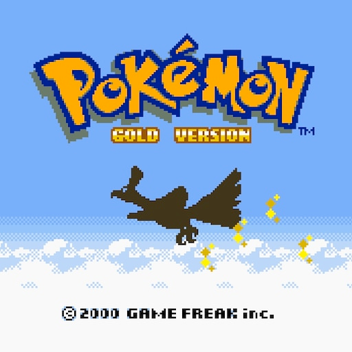
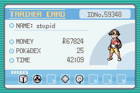
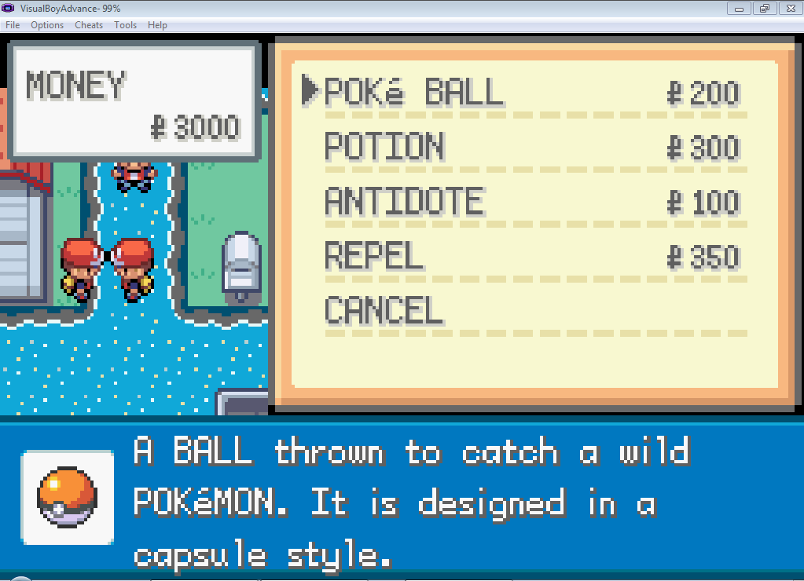
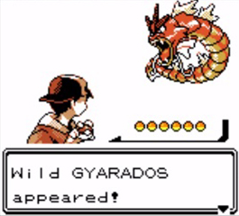

# Clean Architecture com Pokémon

A ideia deste repositório é praticar os conceitos da Clean Architecture de um modo divertido e prático integrando uma API com uma [API de Pokémon de Terceiros](https://pokeapi.co/).

Aqui irei tentar replicar algumas regras do clássico jogo Pokémon Gold do Gameboy.

## Pré-Requisitos

- PHP 7.4 ou superior;
- [Composer](https://getcomposer.org);
- [Slim Framework 4](https://www.slimframework.com);
- [Docker](https://www.docker.com); 
- Sistema de Migrations com [PHINX](https://phinx.org);
- Sistema de Cache com [Redis](https://redis.io);

## Referências e Links

- [Introdução a Arquitetura de Software](https://blog.taller.net.br/introducao-a-arquitetura-de-software)
- [Clean Architecture I – Overview](https://blog.taller.net.br/clean-architecture-overview)
- [erandirjunior/vehicle-backend](https://github.com/erandirjunior/vehicle-backend)
- [erandirjunior/fortbrasil-backend](https://github.com/erandirjunior/fortbrasil-backend)
- [rmanguinho/clean-ranking-loader](https://github.com/rmanguinho/clean-ranking-loader)
- [In Clean Architecture, where to put validation logic?](https://ikenox.info/blog/where-to-put-validation-in-clean-architecture/#:~:text=Just%20as%20Clean%20Architecture%20splits,differrent%20depending%20on%20its%20context.)
- [REST, GraphQL, Clean Architecture e TypeScript com Rodrigo Manguinho // Live #69](https://www.youtube.com/watch?v=P0gpCCA8ZPs)

## Casos de Uso

Abaixo estão listadas os casos de uso para termos uma ideia fechada de Domínio e Regras de Negócios.

### MOCHILA (BAG)

Na mochila do jogador poderá conter:

#### Items

Elixir, Potions, Antidotes e etc. Uma lista mais completa pode ser vista [neste link](https://www.ign.com/wikis/pokemon-red-blue-yellow-version/Items).

#### PokeBall

- Pokeball: Catches Pokemon
- Great Ball: Greater chance of catching Pokemon than a Pokeball
- Ultra Ball: Greater chance of catching Pokemon than a Great Ball
- Master Ball: Always catches Pokemon
- Safari Ball: A special ball for use in the Safari Zone

#### Pokémons

Aqui ficarão os pokémons que ele poderá utilizar na sua jornada. O jogador só poderá ter **no máximo 6 pokémons** consigo, conforme imagem abaixo:

### INFORMAÇÕES DO JOGADOR

O jogador poderá a qualquer momento ter um breve resumo de suas posses, como:
- Dados pessoais;
- Quanto de dinheiro ele possui no momento;
- Total de XP até o momento;
- Total de Pokémons da Pokédex;

### COMPRAR ITENS

O jogador poderá comprar items para serem colocados na bolsa, para que ele possa usar durante sua jornada. É preciso verificar se ele tem dinheiro suficiente para poder fazer as compras.

Ele também poderá comprar Poké bolas, que serão um tipo especial de item, para serem colocados na bolsa e ser usado durante sua jornada para capturar pokemon.

As pokébolas são: **Pokeball**, **Great Ball** e **Ultra Ball**.

### AVISTAR UM POKÉMON

Quando o jogador avistar um pokémon, ele deverá verificar se ele já o viu em algum momento da sua jornada com a Pokédex. Caso ele **NÃO** tenha visto ainda, as informações básicas do pokémon deverão ir para sua Pokedéx, que servirá como um guia de consulta para este mesmo pokemon no futuro.

Caso ele já tenha visto este Pokémon anteriormente, deverá apenas mostrar as informações do pokémon.

### CAPTURAR UM POKÉMON

Para capturar um pokemon o jogador deverá verificar se ele possui pelo menos uma pokébola na sua bolsa.

Caso o pokémon seja **capturado com sucesso** (pode usar um algoritmo randomico para isso):
- Esse pokémon irá ocupar um dos Slots de pokémons do jogador;
- Deverá debitar uma pokébola da sua mochila;
- Na pokédex deverá marcar aquele pokémon como já capturado;
- O jogador deverá ganhar pontos de XP pela captura (pode usar um algoritmo randomico para isso);

Caso o pokémon **NÃO SEJA** capturado:
- Deverá debitar uma pokébola da sua mochila;

Um jogador só poderá ter uma batalha com status `STARTED`, ou seja, quando uma batalha for iniciado por um jogador e ele tentar iniciar uma nova batalha, a batalha anterior deve ser carregada para ele.

