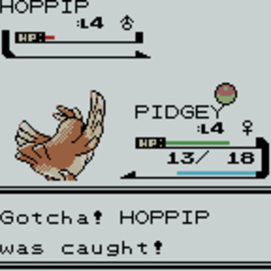

# Use case: CAPTURAR UM POKÉMON

Para capturar um pokemon deve-se ter uma batalha **Em Aberto** para o jogador e mesmo deverá verificar se possui pelo menos uma pokébola na sua bolsa.

O jogador terá 3 tentativas de capturar o pokémon.

> DICA: poderá ser usado um algoritmo randômico para verificar se o pokémon foi capturado ou não.

Caso o pokémon seja **capturado com sucesso**:
- Esse pokémon irá ocupar um dos Slots da Party do jogador;
- Deverá debitar uma pokébola para cada tentativa da sua mochila;
- Na pokédex deverá marcar o pokémon capturado como já capturado;
- O jogador deverá ganhar pontos de XP pela captura (pode usar um algoritmo randômico para isso);

Caso o pokémon **NÃO SEJA** capturado:
- Deverá debitar 3 pokébola da sua mochila;

> IMPORTANTE: um jogador só poderá ter uma batalha **Em Aberto**, ou seja, quando uma batalha for iniciada por um jogador e ele tentar iniciar uma nova batalha, a batalha anterior deve ser carregada.

# Como Testar

@todo