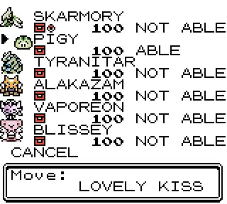

# Use Case: COMPRAR ITENS

O jogador poderá comprar items para serem colocados na bolsa para usá-los durante sua jornada.

É preciso verificar se o jogador tem dinheiro suficiente para poder fazer a compra.

Ele também poderá comprar Poké bolas, que serão um tipo especial de item, para serem colocados na bolsa e ser usado durante sua jornada para capturar pokemons.

## Informações Adicionais

### Mochila (BAG)

Na mochila do jogador poderá conter:

#### Items

Elixir, Potions, Antidotes e etc. Uma lista mais completa pode ser vista [neste link](https://www.ign.com/wikis/pokemon-red-blue-yellow-version/Items).

#### PokeBall

As pokébolas são:

- Pokeball: Catches Pokemon
- Great Ball: Greater chance of catching Pokemon than a Pokeball
- Ultra Ball: Greater chance of catching Pokemon than a Great Ball
- Master Ball: Always catches Pokemon
- Safari Ball: A special ball for use in the Safari Zone

#### Pokémons (Party)

Aqui ficarão os pokémons que ele poderá utilizar na sua jornada. Conforme é chamado de Deck em jogos de cartas, aqui essa lista limitada de pokemons é chamada de **Party**.

O jogador só poderá ter **no máximo 6 pokémons** em sua Party, conforme imagem abaixo:

# Como Testar

@todo